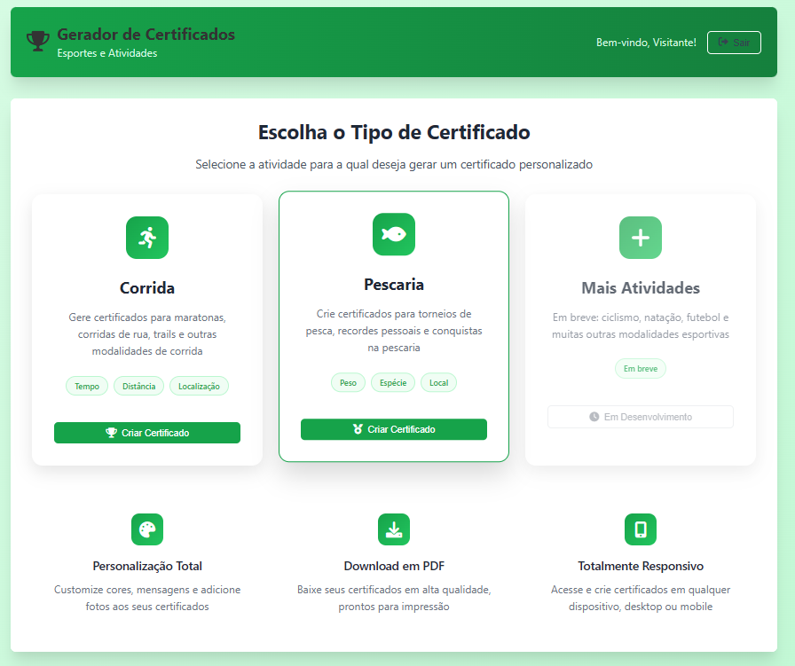
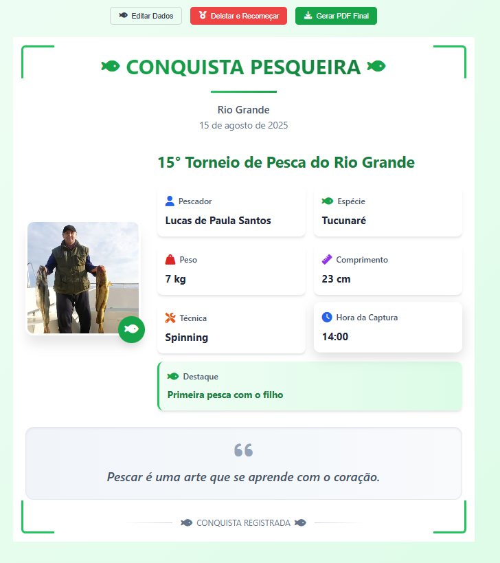

# Gerador de Certificados - Esportes e Atividades

Um sistema web completo para geração de certificados personalizados para diferentes modalidades esportivas.





## 🏆 Funcionalidades

### Sistema de Login
- **Login com credenciais**: E-mail e senha
- **Acesso visitante**: Acesso direto sem cadastro
- **Criar conta**: Funcionalidade para novos usuários
- **Recuperação de senha**: Sistema de reset de senha

### Formulários Disponíveis

#### 🏃‍♂️ Certificados de Corrida
- **Dados do Corredor**: Nome, foto opcional
- **Dados da Corrida**: Nome do evento, local, data
- **Performance**: Distância percorrida, horários de início/término
- **Personalização**: Mensagens motivacionais, notas personalizadas
- **Cálculo automático**: Tempo total baseado nos horários

#### 🎣 Certificados de Pescaria
- **Dados do Pescador**: Nome, foto opcional
- **Dados da Pescaria**: Nome do torneio/evento, local, data
- **Detalhes do Peixe**: Espécie, peso, comprimento
- **Técnica**: Método de pesca, equipamentos, iscas utilizadas
- **Personalização**: Mensagens motivacionais, notas personalizadas

### 🎨 Características do Design
- **Responsivo**: Funciona em desktop, tablet e mobile
- **Interface moderna**: Design limpo e profissional
- **Cores vibrantes**: Gradientes em verde e azul
- **Ícones FontAwesome**: Interface visual rica
- **Animações suaves**: Transições e efeitos visuais

## 📁 Estrutura do Projeto

```
certificados-site/
├── index.html          # Página principal com todos os formulários
├── styles.css          # Estilos CSS responsivos
├── script.js           # JavaScript para navegação e funcionalidades
└── README.md           # Documentação do projeto
```

## 🚀 Como Usar

1. **Abra o arquivo `index.html`** em qualquer navegador moderno
2. **Faça login** ou use o **Acesso Visitante**
3. **Escolha o tipo de certificado** (Corrida ou Pescaria)
4. **Preencha os dados** nos formulários
5. **Gere a prévia** do certificado
6. **Baixe em PDF** ou edite conforme necessário

## 🔧 Tecnologias Utilizadas

- **HTML5**: Estrutura semântica
- **CSS3**: Estilos responsivos com Flexbox e Grid
- **JavaScript**: Navegação SPA e validações
- **FontAwesome**: Ícones profissionais
- **Design Responsivo**: Mobile-first approach

## 📱 Responsividade

O site foi desenvolvido com design responsivo, adaptando-se automaticamente a:
- **Desktop**: Layout completo com múltiplas colunas
- **Tablet**: Layout adaptado para telas médias
- **Mobile**: Layout em coluna única otimizado para touch

## 🎯 Funcionalidades Futuras

O sistema foi preparado para expansão com:
- **Mais modalidades esportivas**: Ciclismo, natação, futebol, etc.
- **Sistema de usuários**: Cadastro completo e histórico
- **Templates personalizados**: Diferentes designs de certificados
- **Integração com redes sociais**: Compartilhamento direto
- **Sistema de medalhas**: Conquistas e rankings

## 🔒 Segurança

- **Validação client-side**: Verificação de dados obrigatórios
- **Sanitização de inputs**: Prevenção de XSS
- **Estrutura preparada**: Para implementação de autenticação backend

## 📞 Suporte

Para dúvidas ou sugestões sobre o sistema, entre em contato através dos canais de suporte.

---

**Desenvolvido com ❤️ para celebrar conquistas esportivas!**

